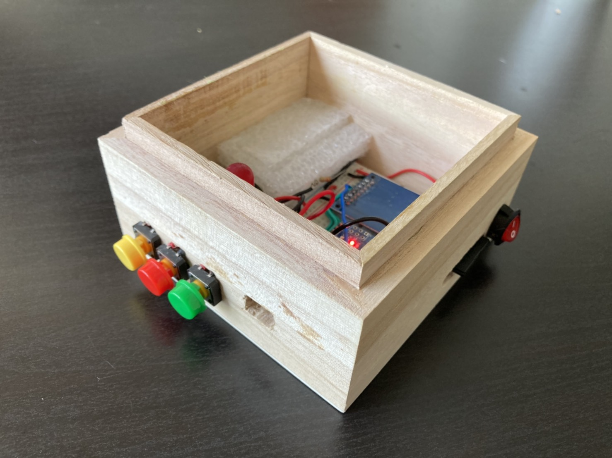
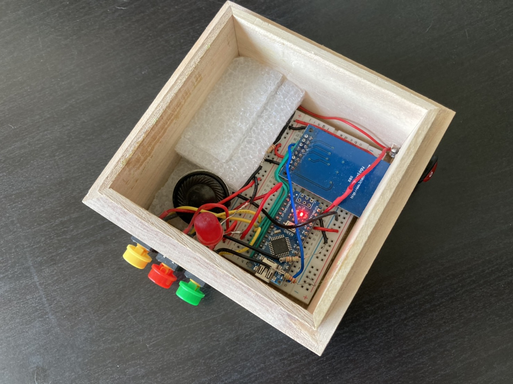
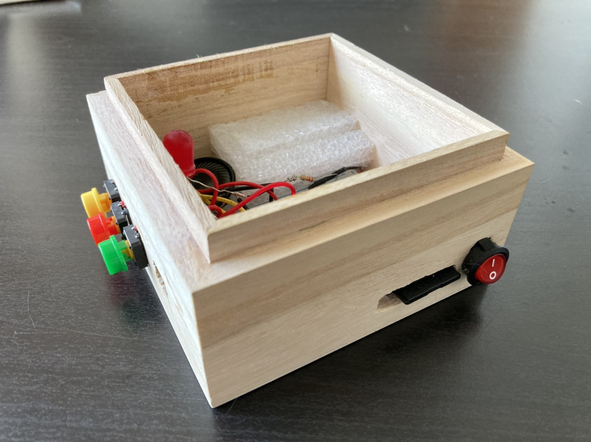
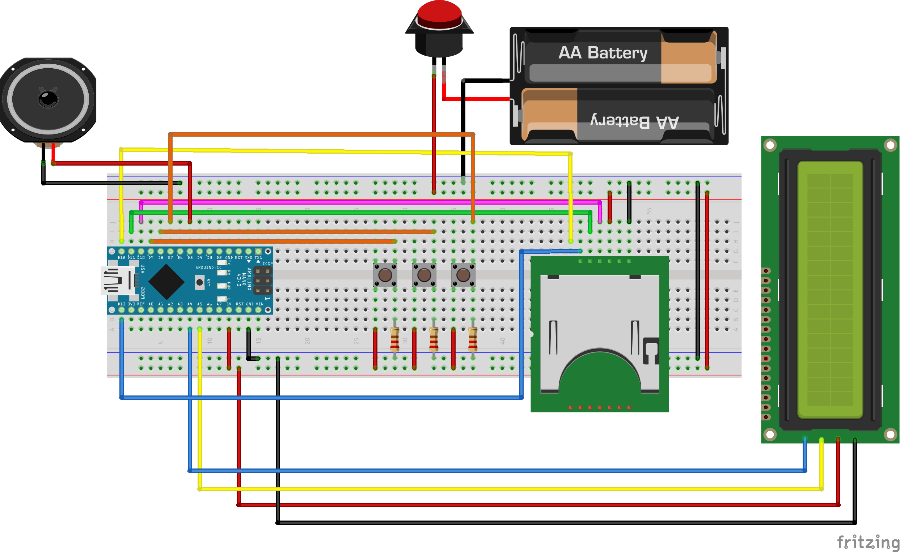
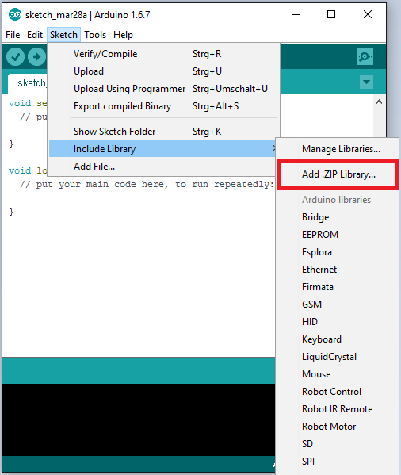
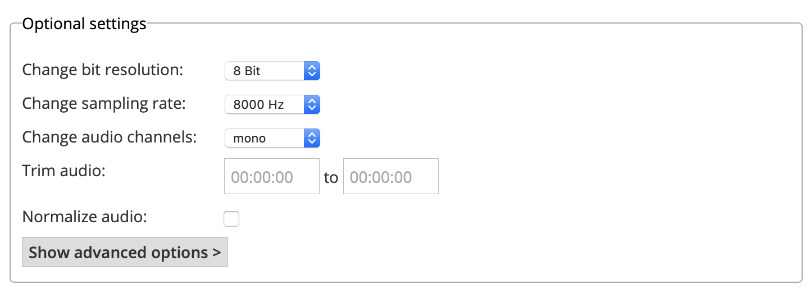

<!-- PROJECT LOGO -->
 

  
  <h3 align="center">Music Box</h3>
  

    Self-Made Music Box
     
    <a href="https://youtu.be/K19CnvB4NbM">View Demo</a>
  

<!-- ABOUT THE PROJECT -->
## About The Project

This is a **Self-Made Music Box** built with Arduino. Music will be read through SD module (LC-SD) and output by a 8-Ohm 2W speaker. Buttons on the box supports **Play/Stop, Next/Previous**; LCD was prepared to show music name. However, the LCD module doesn't support Traditional Chinese output, so the LCD was not implemented in this project finally.

- [x] Read Music From SD card
- [x] Play music from speaker
- [x] Play/Stop, Next/Previous
- [ ] Show information from LCD

      
      

### Built With

* [Arduino Nano](https://store.arduino.cc/usa/arduino-nano)
* [LC Technology SD Card Module LC-SD](https://www.amazon.co.uk/LC-Technology-Module-LC-SD-Arduino/dp/B01LWK2VCK)
* 8-Ohm 2-W Speaker

### Schematic

<!-- GETTING STARTED -->
## Getting Started

### Libraray
Import all the libraries in ./Library/

  

  

### Music Format
Music format must be .wav, 8 Bit resolution, 8 KHz sample rate, mono audio. You can convert your audio file with [this site](https://audio.online-convert.com/convert-to-wav).

